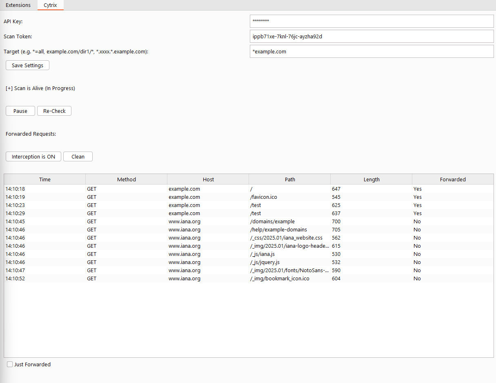

<!DOCTYPE html>
<html lang="en">
<head>
    <meta charset="UTF-8">
    <meta name="viewport" content="width=device-width, initial-scale=1.0">
</head>
<body>
    <h1>CYTRIX Interception (BurpSuite Extension)</h1>
    
The Cytrix Interception (Burp Extension) is a powerful tool designed to integrate seamlessly with Burp Suite, enabling security professionals and penetration testers to streamline their workflows by automating the process of transferring intercepted requests to Cytrix's advanced scanning platform in real-time.

    <h2>Purpose</h2>
    
This extension allows you to transfer HTTP requests intercepted or generated in Burp Suite to Cytrix's automatic scanning engine. Once a request is sent to Cytrix, the platform immediately starts attacking the specified endpoints, using its comprehensive vulnerability detection engine to identify potential security flaws. This eliminates the need for manual configuration, enabling automatic and efficient endpoint testing.

    <h2>Key Features</h2>
    <ul>
        <li><strong>Real-Time Request Forwarding:</strong> Automatically forwards intercepted or generated requests in Burp Suite to Cytrix for immediate scanning.</li>
        <li><strong>Easy Integration:</strong> Simple setup with API Key and Token, allowing configuration of target host patterns.</li>
        <li><strong>Granular Target Control:</strong> Users can define request forwarding patterns using wildcards.</li>
        <li><strong>Manual Request Forwarding:</strong> Right-click on any request in Burp Suite to manually send it to Cytrix.</li>
        <li><strong>Scan Status Monitoring:</strong> Check scan status and control scanning activity from within Burp Suite.</li>
        <li><strong>Forward Request Logging:</strong> View logs of all forwarded and non-forwarded requests.</li>
        <li><strong>Real-Time Updates:</strong> Ensures transparency in forwarded requests.</li>
    </ul>
    <h2>How It Works</h2>
    <ul>
        <li><strong>Automatic Request Forwarding:</strong> Configured with valid Cytrix credentials, requests are forwarded automatically based on filters.</li>
        <li><strong>Immediate Attack Initiation:</strong> Cytrix scans forwarded requests and attacks endpoints in real-time.</li>
        <li><strong>Manual Overrides:</strong> Requests can be manually forwarded via the Burp Suite context menu.</li>
    </ul>
    <h2>Use Cases</h2>
    <ul>
        <li><strong>Penetration Testing Automation:</strong> Reduces manual configuration time.</li>
        <li><strong>Seamless Collaboration:</strong> Integrates Burp Suite with Cytrix's automated scanning.</li>
        <li><strong>Comprehensive Security Coverage:</strong> Ensures all endpoints discovered during testing are scanned automatically.</li>
    </ul>
    <h2>Benefits</h2>
    <ul>
        <li>Save time and effort by automating intercepted request scanning.</li>
        <li>Improve test coverage by ensuring active attacks on all endpoints.</li>
        <li>Gain real-time insights into vulnerabilities using Cytrix's scanning technology.</li>
    </ul>
    

    <h2>Setting Up Jython</h2>
    
To ensure smooth operation, Jython must be installed and configured within Burp Suite. Follow these steps:

    <ol>
        <li>Download the standalone Jython JAR file from <a href="https://www.jython.org/download.html" target="_blank">Jython's official site</a>.</li>
        <li>Open Burp Suite, navigate to "Settings", and go to the "Extensions" tab.</li>
        <li>Under the "Python Environment" section, select the downloaded Jython standalone JAR file.</li>
    </ol>
    

    <h2>Installing the CYTRIX Extension</h2>
    
Follow these steps to install and configure the CYTRIX extension:

    <ol>
        <li>Download the extension from <a href="https://github.com/Cytrixio/Cytrix-BurpSuite-Extension" target="_blank">GitHub</a>.</li>
        <li>Open Burp Suite and go to the "Extensions" tab.</li>
        <li>Click "Add", select "Python" as the extension type, and choose the <code>extension.py</code> file.</li>
        <li>Once installed, navigate to the "CYTRIX" tab in Burp Suite.</li>
        <li>Enter your API Key and Scan Token, select the target, and click "Save Settings".</li>
    </ol>
    

    
<strong>Contact:</strong> <a href="mailto:info@cytrix.io">info@cytrix.io</a> | <a href="https://cytrix.io" target="_blank">CYTRIX.io</a>

    

</body>
</html>

Screenshot:
